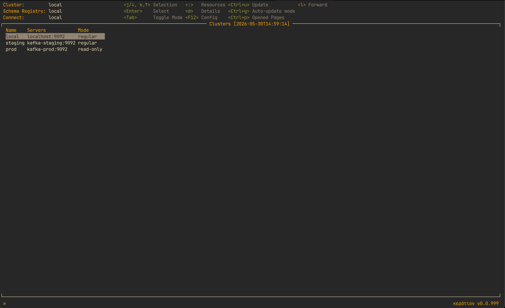

# Karat 🎯

A terminal UI for Apache Kafka. Browse and manage clusters, topics, consumer groups, Schema Registry subjects and Connect connectors from the keyboard, without leaving the terminal.




## Table of Contents

- [Features](#features)
- [Available Resources](#available-resources)
- [Installation](#installation)
- [Getting Started](#getting-started)
- [Configuration](#configuration)
- [Development](#development)
- [License](#license)
- [Acknowledgments](#acknowledgments)
- [Support](#support)


## Features

- **Multiple clusters** — connect to several clusters and switch between them while Karat is running.
- **Topics** — browse, create, edit configs, increase partitions, delete.
- **Topics as a document** — `n` and `e` open the topic as YAML in your editor. Settings still at their cluster default come along as commented-out lines, so overriding one is a matter of uncommenting it, and deleting a config line resets it. A review page shows what will change before anything is applied.
- **Topic producers** — active producers and in-flight transactions, per partition.
- **Hide internal topics** — `i` hides `__*`, `*-changelog` and `*-repartition`. The patterns are yours to change.
- **Extra actions menu** — `.` on a topic page, for the secondary actions: Consume, CLI commands, Producers, Consumer groups.
- **Consumer** — kcat-style parameters: offsets, timestamps, partitions, consumer group, avro/pack deserialization, output format, filter. `c` on the Topics list starts consuming right away with whatever you used last on that topic, `F1` shows the flag reference, and `Ctrl+O` opens the parameters in your editor with that reference inlined as comments.
- **Parameter history** — every parameter string you actually run is kept per cluster and topic in `~/.config/karat/history.yaml` and survives restarts. `Ctrl+R` picks one to reuse.
- **Consumer groups** — lag, partition assignments, offset resets, copying offsets to a new group.
- **Offsets as a document** — `o` opens the group's committed offsets as YAML, one value per partition: an absolute offset, `earliest`, `latest`, `@<timestamp>` or `none`. `all:` sets every topic at once, and naming a topic the group has never consumed seeds offsets for it.
- **One offset-reset pipeline** — the document sets each partition on its own; the legacy Reset Offsets modal (`karat.features.reset_offsets_modal`) sets one strategy per topic, shared by all of its partitions. Both take the same path afterwards: resolve, range-check, confirm per partition, commit. Offsets outside the log are refused rather than sent, because the broker accepts them and the consumer then silently overrides them. Seeding only writes a starting position — nothing subscribes to the topic, but a consumer that joins later resumes from it instead of falling back to `auto.offset.reset`.
- **Transactions** — cluster-wide, with transactional ID, producer ID, state, timeout and partitions.
- **ACLs** — principal, resource, pattern type, operation, permission.
- **Schema Registry** — subjects, their versions, and the schemas themselves.
- **Kafka Connect** — connectors and their status, pause/resume/restart/stop, and source connector offsets.
- **Nodes** — broker information and configuration.
- **CLI templates** — run kcat, kafka-console-consumer or a script of your own with the cluster and topic filled in.
- **Page history** — move back and forward through the pages you have opened.
- **Search** — fuzzy matching across topics, consumer groups, subjects, connectors, transactions and ACLs.
- **Sorting** — any column, ascending or descending.
- **Background columns** — topic on-disk size and consumer-group lag arrive after the list is already on screen (the header carries a `…` until they do). Either can be switched off in `karat.features`.
- **Caching** — 5 minutes per resource, and `Ctrl+U` forces a refresh of any view.
- **Update notifications** — Karat checks GitHub for a newer release on startup and mentions it in the status bar.


## Available Resources

Press `:` to open the resource menu. Schema Registry and Connect entries appear only once you have configured them.

| Resource | Description | Operations |
|----------|-------------|------------|
| **Clusters** | Kafka cluster management | Select, describe |
| **Schema-registries** | Schema Registry instances | Select |
| **Connect** | Kafka Connect instances | Select |
| **Nodes** | Kafka brokers | List, describe |
| **Topics** | Kafka topics | List, describe (incl. on-disk size), create and edit configs as a document in your editor, reset configs to cluster default, increase partitions, delete, search, sort, hide internal topics, view producers, consume messages, find consumer groups by topic, CLI templates, extra actions menu |
| **Consumer groups** | Consumer groups | List, describe, view lag, reset offsets per partition as a document in your editor (`o`), seed offsets for a new topic, copy offsets to a new group, delete (Empty state only), find by topic, search, sort |
| **Transactions** | Cluster-wide Kafka transactions | List, describe, search, sort |
| **ACLs** | Cluster access control lists | List, search, sort |
| **Subjects** | Schema Registry subjects | List, view versions, inspect schemas, search |
| **Connectors** | Kafka Connect connectors | List, describe, pause/resume/restart/stop, delete, manage source connector offsets, search, sort |


## Installation

### Dependencies

Karat links against `librdkafka`, so it has to be on the system first:

- macOS: `brew install librdkafka`
- Ubuntu/Debian: `apt-get install librdkafka-dev`
- RHEL/CentOS: `yum install librdkafka-devel`


### Homebrew (macOS)

```bash
# Add the tap
brew tap uraniumdawn/karat

# Install karat
brew install karat
```

### From Source

```bash
# Clone the repository
git clone https://github.com/uraniumdawn/karat.git
cd karat

# Build
go build -o karat

# Move to your PATH
mv karat /usr/local/bin/
```

## Getting Started

### 1. Write the config

Karat needs one file to start:

- `~/.config/karat/config.yaml` — your clusters and Karat's own settings (required)
- a style file for colors, pointed at by `karat.style` in config.yaml (optional)

There is a third file you do not write: `~/.config/karat/history.yaml`, where Karat keeps the consume parameters you have used per cluster and topic (newest first, 30 at most). Deleting it loses nothing but that history.

Creating a topic, editing one, and resetting consumer group offsets all happen in an editor, so point `karat.editor` at one you can drive. It defaults to `vim`. See [Editor](#editor).

### 2. Run Karat

```bash
karat
```

To check the version:

```bash
karat -version
```

## Configuration

### config.yaml

A `~/.config/karat/config.yaml` with two clusters, a Schema Registry and a Connect instance looks like this:

```yaml
karat:
  # API Configuration
  api:
    timeout: 30       # API call timeout in seconds (default: 30)
    max_concurrency: 10  # Max parallel Kafka API calls, e.g. for consumer group offset queries (default: 10)

  # Editor used by every editor-backed view (optional, default: vim)
  # Split on whitespace, so flags are allowed: "code --wait"
  editor: "vim"

  # Optional features (optional)
  features:
    # Columns that need extra Kafka requests — both default to true
    topic_size: true          # Topics list "Size" column + topic description actual size
    consumer_group_lag: true  # Consumer Groups list "Lag" column
    # Legacy form modals. Switches, not on/off: false = document in your editor,
    # true = the old form. The key works either way.
    create_edit_topic_modal: false  # "n" / "e" on the Topics page
    reset_offsets_modal: false      # "o" on a Consumer Group

  # UI Configuration (optional)
  ui:
    # Regex patterns used to classify topics as internal when hiding internal
    # topics (press "i" on the Topics page). Overrides the built-in defaults
    # (^__.*, .*-changelog$, .*-repartition$).
    internal_topic_patterns:
      - "^__.*"
      - ".*-changelog$"
      - ".*-repartition$"

  # Style file path (optional) — see examples/style/ for ready-made themes
  style: ~/.config/karat/my_style.yaml

  # Define your Kafka clusters
  clusters:
    - name: prod
      # Standard librdkafka configuration properties as documented in:
      # https://github.com/confluentinc/librdkafka/blob/master/CONFIGURATION.md
      properties:
        bootstrap.servers: kafka-prod:9094
        # Add any librdkafka properties here:
        # security.protocol: SASL_SSL
        # sasl.mechanisms: PLAIN
        # sasl.username: your-username
        # sasl.password: your-password
      selected: true  # Auto-select this cluster on startup
      # mode: read-only  # Uncomment to prevent create/edit/delete operations on this cluster

    - name: dev
      properties:
        bootstrap.servers: kafka-dev:29094
      selected: false

  # Schema Registry configurations (optional)
  schema-registries:
    - name: prod
      # Required: Schema Registry URL
      schema.registry.url: http://schema-registry-prod:8081

      # Optional: Basic authentication for Schema Registry
      # schema.registry.sasl.username: registry-user
      # schema.registry.sasl.password: registry-pass
      selected: true  # Auto-select this registry on startup

    - name: dev
      schema.registry.url: http://schema-registry-dev:8081
      selected: false

  # Kafka Connect configurations (optional)
  connect:
    - name: prod
      # Required: Kafka Connect REST API URL
      url: http://kafka-connect-prod:8083
      selected: true  # Auto-select this connect cluster on startup
      # mode: read-only  # Uncomment to prevent edit/delete/action operations on this instance

    - name: dev
      url: http://kafka-connect-dev:8083
      selected: false

  # CLI Templates for external tool integration (optional)
  # Supported placeholders:
  #   {{bootstrap}} — broker address(es) from the selected cluster
  #   {{topic}}     — name of the selected topic
  #   {{srURL}}     — Schema Registry URL from the selected registry
  cli_templates:
    # kcat example - consume from beginning with JSON formatting
    - kcat -b {{bootstrap}} -t {{topic}} -o beginning -f '{"Key":"%k","Value":%s,"Timestamp":%T,"Partition":%p,"Offset":%o,"Headers":"%h","Size":%S}\n' -u | jq .

    # kcat example - consume from end (live)
    - kcat -b {{bootstrap}} -t {{topic}}

    # kafka-console-consumer
    - kafka-console-consumer --bootstrap-server {{bootstrap}} --topic {{topic}} --from-beginning

    # Custom script example
    - ./scripts/analyze-topic.sh {{bootstrap}} {{topic}}
```

#### Important Configuration Notes

**librdkafka Properties:**
All properties in the `properties` map are passed directly to librdkafka. Karat supports:
- Connection settings (bootstrap.servers, security.protocol)
- Authentication (SASL, SSL, OAuth)
- Client configuration (request.timeout.ms, retry settings)
- Debug settings (debug: all)

**Environment Variables:**
Use `${VAR_NAME}` syntax for environment variable expansion:
```yaml
sasl.password: ${KAFKA_PASSWORD}
```

**Selected Flag:**
- Only one cluster, one schema registry, and one Kafka Connect instance should have `selected: true`
- Selection is persisted when changed via UI

**Default configuration:**
- Karat has built-in defaults for the `api`, `features`, and `ui` sections (embedded in the binary)
- Your `config.yaml` is merged on top — only the keys you specify override the defaults, and every key you leave out keeps its default
- Whatever you set is applied, including `false`, `0`, `""`, and empty lists
- Sections merge key by key: overriding `karat.features.topic_size` leaves the other feature flags at their defaults
- Lists replace the default list entirely instead of extending it
- Style files follow exactly the same rules on top of the built-in style defaults

**API settings (`api:`):**
- `timeout` — timeout in seconds for all Kafka Admin API calls (cluster describe, topic operations, consumer group queries). Default: 30
- `max_concurrency` — maximum number of parallel Kafka API calls, used when querying consumer group offsets across many groups (find-by-topic and the Consumer Groups lag column). Default: 10

**Feature settings (`features:`):**

The first two control a column that needs extra Kafka requests to fill. Both default to `true`; set one to `false` to hide the column, drop its `3` sort key, and stop those requests — useful on large or slow clusters. These columns are filled in the background: the header shows a trailing `…` (`Size…`, `Lag…`) while the values are still being fetched, and cells show `-` until they arrive.
- `topic_size` — Topics list `Size` column and the topic description's actual size. Default: `true`
- `consumer_group_lag` — Consumer Groups list `Lag` column, on both the Consumer Groups list and the find-by-topic view. Default: `true`

The other two bring back the **legacy** form modals that the [editor](#editor) documents replaced. They are switches, not on/off flags: the key works either way, the flag only decides which UI it opens. Both default to `false`, so the documents are what you get; the forms are kept for anyone not ready to move and may be removed in a future release.
- `create_edit_topic_modal` — `false`: `n` and `e` on the Topics page open a topic document. `true`: they open the legacy Create/Edit Topic forms. Default: `false`
- `reset_offsets_modal` — `false`: `o` on a Consumer Group opens an offsets document, one line per partition. `true`: it opens the legacy Reset Offsets form, which sets one strategy per topic. Default: `false`

**Editor setting (`editor:`):**
- `editor` — command line used for every editor-backed view, and the only place Karat looks for one. Split on whitespace, so flags are allowed (`"code --wait"`). An empty value falls back to `vim`. Default: `vim`. See [Editor](#editor)

**UI settings (`ui:`):**
- `internal_topic_patterns` — list of regular expressions used to classify topics as internal when hiding internal topics (`i` on the Topics page). Replaces the built-in defaults (`^__.*`, `.*-changelog$`, `.*-repartition$`) entirely if set; set it to `[]` to treat no topic as internal.

**Read-only mode:**
- Set `mode: read-only` on a cluster or Kafka Connect instance to prevent any write operations (create, edit, delete, actions) via the UI
- Useful for protecting production environments

**Transactions, ACLs, Topic Producers, and topic size:**
- These features connect to the cluster via [franz-go](https://github.com/twmb/franz-go), built from the same `properties` as the cluster's main connection
- Supported SASL mechanisms: `PLAIN`, `SCRAM-SHA-256`, `SCRAM-SHA-512`. If the cluster's `sasl.mechanism`/`sasl.mechanisms` is unsupported, these views show a connectivity error while the rest of the UI continues to work normally

### Style

Set the path to a style file via `karat.style` in `config.yaml`:

```yaml
karat:
  style: ~/.config/karat/my_style.yaml
  clusters:
    ...
```

The style file is merged on top of the built-in defaults, so you only need to override the fields you want to change. Colors can be specified as tcell color names (`"white"`, `"grey"`) or RGB hex values (`"#1E1E1E"`). Use `"default"` to inherit your terminal's background or foreground color.

**Ready-made themes** — see [`examples/style/README.md`](examples/style/README.md) for previews and usage.

### Editor

Karat suspends the TUI and hands the terminal to your editor for the views where a document beats a form:

| Where | Key | Document |
|-------|-----|----------|
| Topics page | `n` / `e` | Topic definition — name, replication factor, partitions, configs |
| Consumer Group | `o` | Committed offsets, one line per partition |
| Connector | `e` / `n` | Connector config JSON |
| Consume parameters | `Ctrl+O` | Consume parameters |

Topic and offset editing end on a confirmation page showing exactly what will be applied — nothing reaches the cluster until you press `Ctrl+Enter` there. The legacy form modals are still reachable on the same keys via [`create_edit_topic_modal` and `reset_offsets_modal`](#important-configuration-notes).

**Choosing the editor.** `karat.editor` in `config.yaml` is the only place Karat looks, so name the editor you want there. It defaults to `vim` and is split on whitespace, so flags are allowed:

```yaml
karat:
  editor: "nano"
  # editor: "vim -u NONE"
  # editor: "emacs -nw"
```

**GUI editors need a wait flag.** They hand the file to an already-running instance and exit immediately, so without one Karat reads the file back before you have touched it:

```yaml
karat:
  editor: "code --wait"        # also code-insiders, codium
  # editor: "subl -w"          # also sublime_text
  # editor: "mate -w"          # TextMate
```

Karat detects the missing flag and tells you which one to add rather than reporting "no changes". Note the TUI stays suspended for as long as the editor window is open.

Quitting the editor without saving is always safe — the content comes back unchanged and nothing is applied. Aborting with a non-zero exit (`:cq` in vim) is reported as such and applies nothing either.

## Development

### Prerequisites

- Go 1.25 or newer
- librdkafka, as above
- a Kafka cluster to point it at

### Building from Source

```bash
# Clone repository
git clone https://github.com/uraniumdawn/karat.git
cd karat

# Install dependencies
go mod download

# Build (CGO_ENABLED=1 required for confluent-kafka-go)
CGO_ENABLED=1 go build -o karat

# Run
./karat
```

### Logging

Everything goes to `~/.config/karat/karat.log`, one line per entry: an RFC3339 timestamp and the caller as `file:line`. `INFO` covers startup and shutdown, `DEBUG` the event handler lifecycle, `ERROR` failed operations, API errors and timeouts.

Since the TUI owns the terminal, a second one is the usual way to read it:

```bash
tail -f ~/.config/karat/karat.log
grep ERROR ~/.config/karat/karat.log
```

## License

MIT — see [LICENSE](LICENSE).

## Acknowledgments

Karat is built on:

- [tview](https://github.com/rivo/tview) — the terminal UI framework, and [tcell](https://github.com/gdamore/tcell) underneath it
- [confluent-kafka-go](https://github.com/confluentinc/confluent-kafka-go) and [librdkafka](https://github.com/confluentinc/librdkafka) — the main Kafka client
- [franz-go](https://github.com/twmb/franz-go) — transactions, ACLs, producers and log directory queries
- [go-cache](https://github.com/patrickmn/go-cache) — the in-memory cache behind every list
- [fuzzysearch](https://github.com/lithammer/fuzzysearch) — inline search
- [zerolog](https://github.com/rs/zerolog) — logging

Borrowed ideas from [k9s](https://github.com/derailed/k9s) and [lazydocker](https://github.com/jesseduffield/lazydocker), and from [Redpanda Console](https://github.com/redpanda-data/console) — the topic on-disk size and connector health views came from looking at it.


## Support

Bugs and feature requests go to the [issue tracker](https://github.com/uraniumdawn/karat/issues). For anything else, sirozhaua@gmail.com.

---
