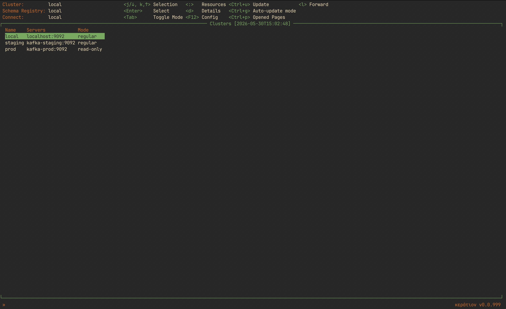
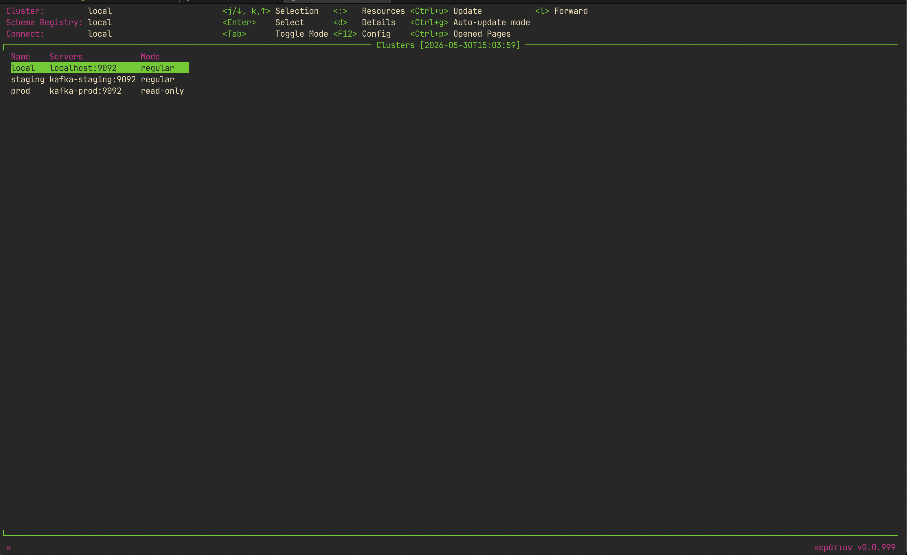
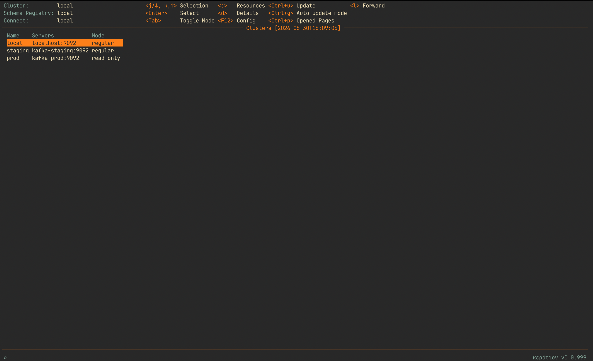
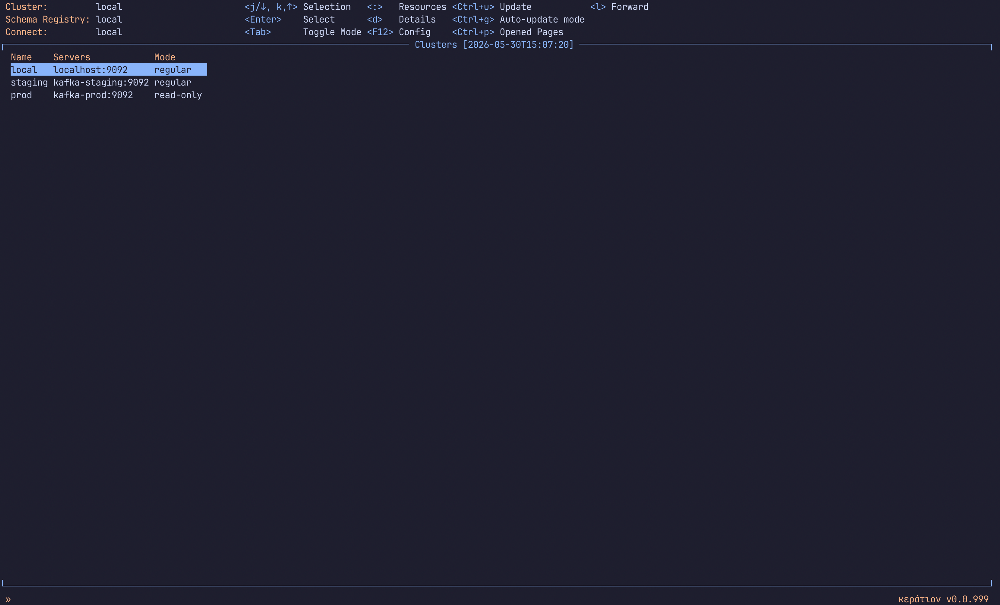
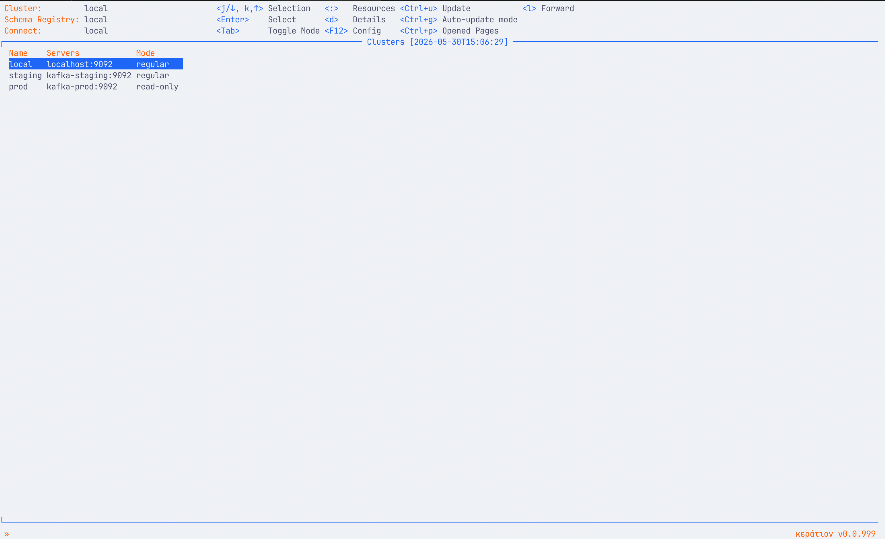
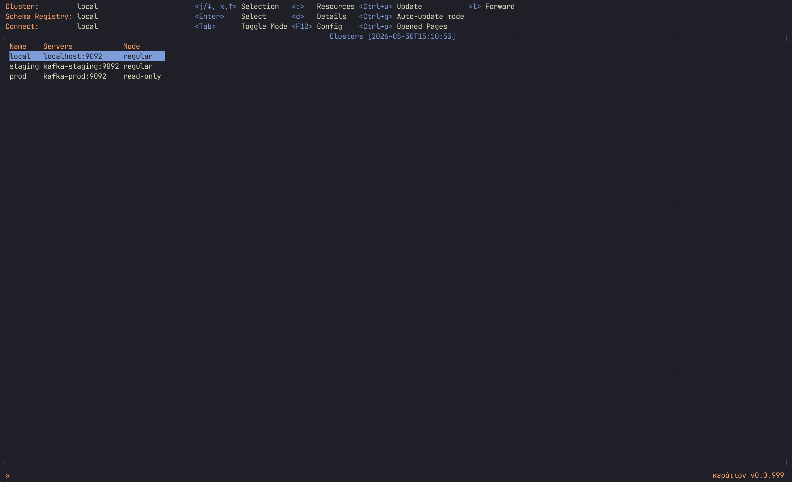
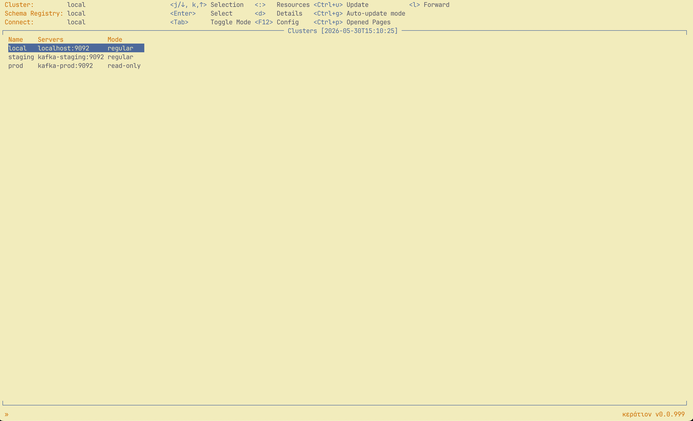
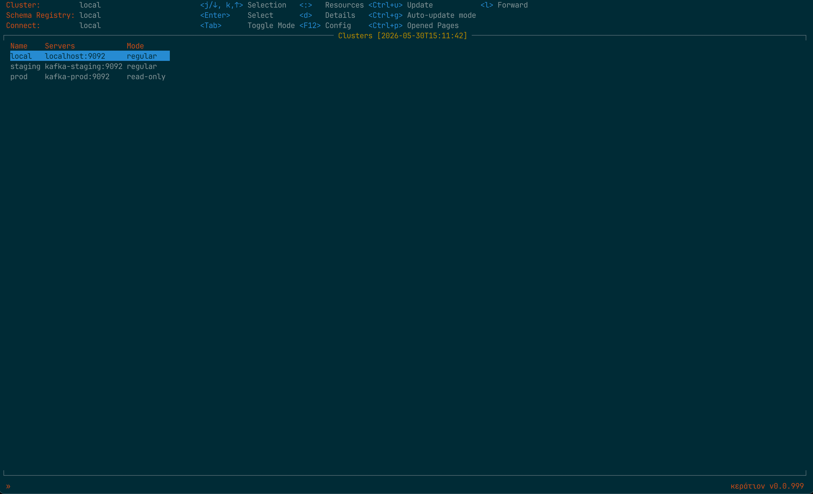
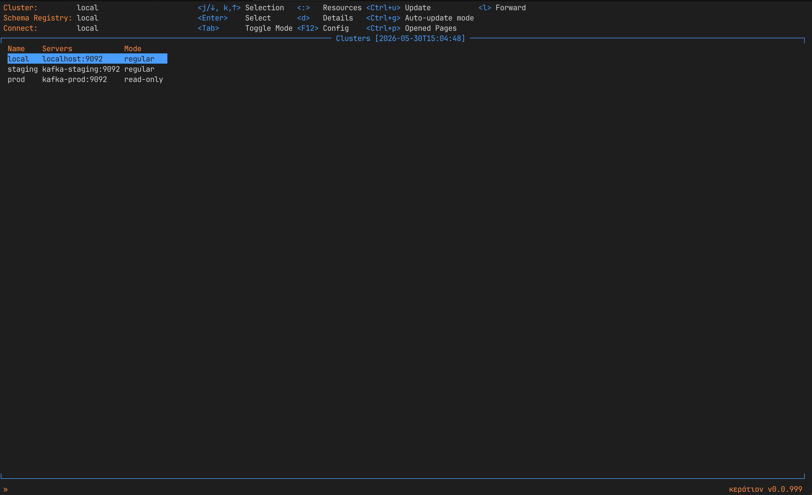

# Styles

Copy a style file to `~/.config/skog/` and reference it in your `config.yaml`:

```yaml
skog:
  style: uranium_v3  # filename without .yaml
```

---

## uranium_v3

Dark background with orange/amber accents and grey keybindings.


---

## uranium_v2

Dark background with green accents.



---

## uranium

Dark background with pink/magenta labels and green accents.



---

## gruvbox_dark

Dark background with orange accents and orange selection highlight.



---

## gruvbox_light

Warm cream background with orange accents and dark orange selection highlight.


---

## catppuccin_mocha

Dark navy background with blue accents.



---

## catppuccin_latte

Light background with blue accents and orange status bar.



---

## kanagawa_wave

Dark blue-grey background with blue selection and golden accents.



---

## kanagawa_lotus

Warm parchment background with blue selection and golden accents.



---

## solarized_dark

Deep teal background with blue selection and orange accents.



---

## blue_accents

Dark background with blue accents and orange status bar.


